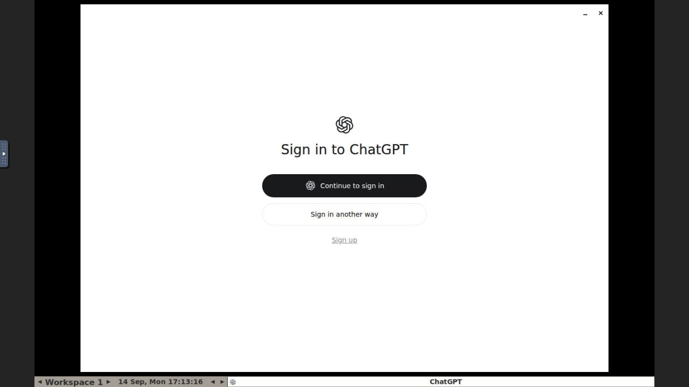

# Official Linux desktop installation

Verified on 2026-09-14 in a disposable Ubuntu 24.04 ARM64 container:

```text
bash hermes_runtime/install_agent_desktops.sh
chatgpt 26.908.61612
claude-desktop 1.52386.6
```

The ChatGPT desktop app opened its native sign-in view in a Linux display,
then opened the official browser login. The tested account required Google
SSO; completing that owner challenge is pending. This is installation and
launch evidence, not proof of authenticated model access. Claude's package
installation passed; a live Claude desktop response is not claimed here.



The installer is explicit and checks the vendor package architecture and
Anthropic repository signing fingerprint. Assignment writes the selected
app's launcher without changing the existing CLI launcher. Unit tests cover
missing apps, unknown systems, private launcher permissions, valid shell
syntax and inventory that neither launches an app nor reads provider auth.

Image baking and fresh-guest verification belong to the deploying platform;
this smoke does not claim an AMD64 GCE image has been baked or deployed.
