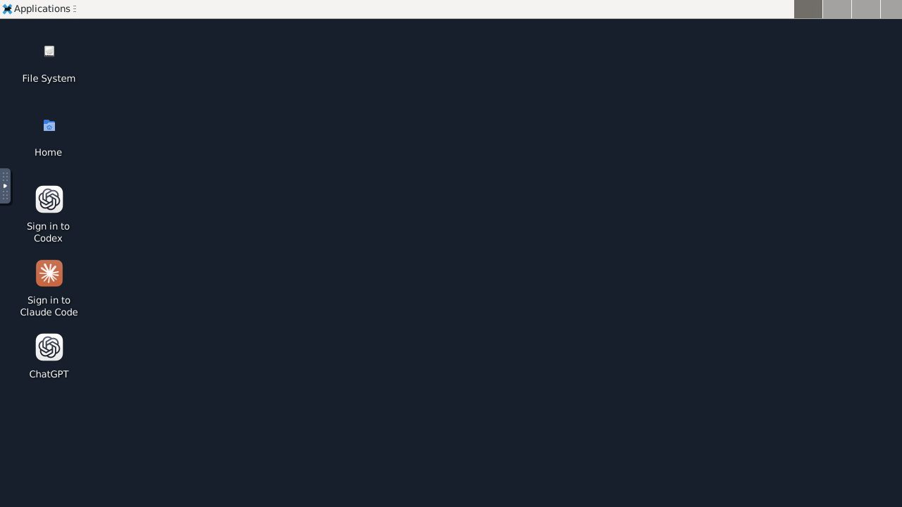
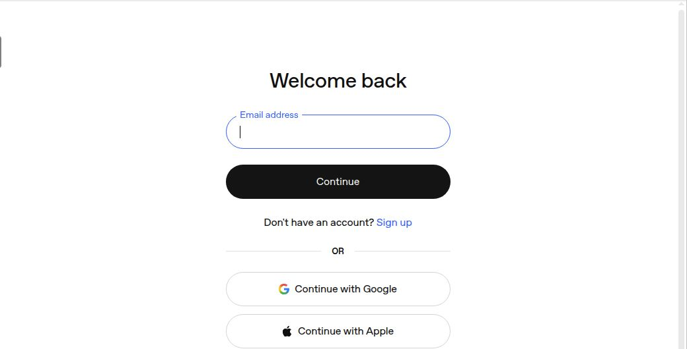
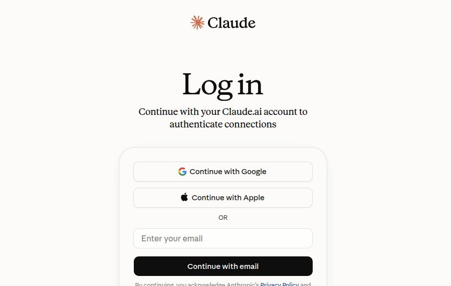

# Native browser sign-in verification

Verified on an isolated Linux x86_64 Computer cloned from the preinstalled
agent image, with XFCE, Chrome, Codex and Claude Code already installed. No
provider account credentials were entered or copied. This verifies reaching
credential entry, not completing provider authentication or a model response.

The old worker failed because the image provides `xset` but lacks `xdpyinfo`.
The updated worker reached `opening` then `waiting`. Claude Code 2.1.266 also
uses `https://claude.com/cai/oauth/authorize`, which redirects to its sign-in
page. Its printed login URL is handled privately when the CLI browser hook
does not open the page; the hook and fallback share a launch lock.

```text
Old worker: codex -> failed
Updated worker: codex -> opening -> waiting
Updated worker: claude_code -> opening -> waiting
Runtime tests: 643 passed
```

Codex Browser Use verified the desktop shortcuts and the real provider pages.
The screenshots are cropped to omit OAuth URLs and show no account data.
Desktop app authentication remains a separate provider-owned login.




