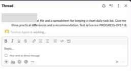
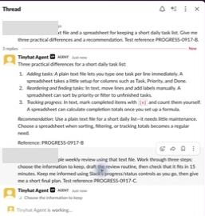
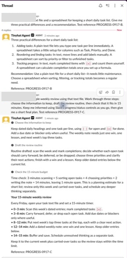
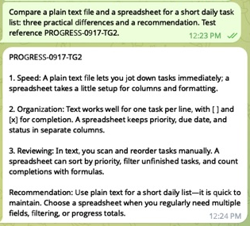
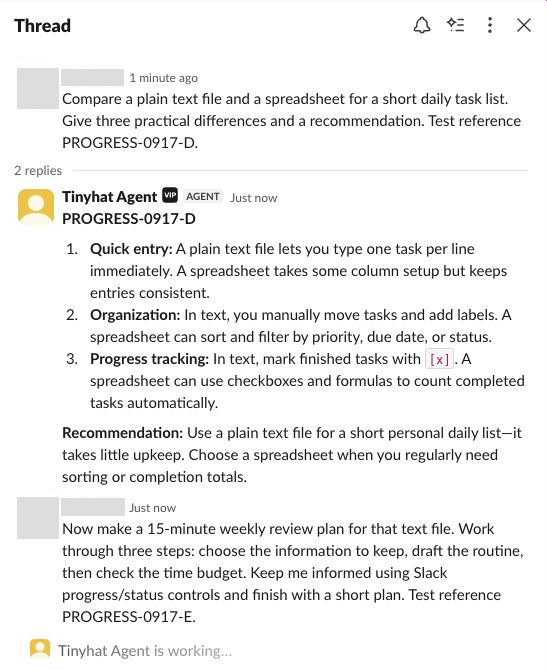
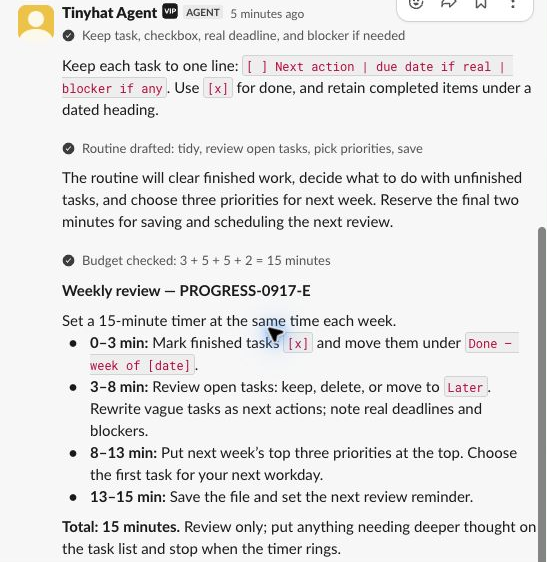
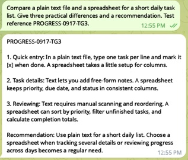

# Channel receipt and progress verification

Verified on 2026-09-17 with real incoming messages in Slack Desktop and
Telegram Desktop, routed to authenticated Codex. These are actual app captures;
personal names, avatars, and unrelated conversations have been cropped or
redacted. No provider messages or model replies were simulated.

## Slack

Before the change, an ordinary question started a thread, but its answer
appeared in the root DM about 40 seconds later. The worker called discovery and
`chat.postMessage` without `channel_typing`; routing had already cleared the
initial receipt.

The candidate was tested on an existing Linux Computer and its existing Slack
agent. An ordinary comparison question (test B) showed a working indicator,
streamed its answer, and completed in the same thread. A follow-up (test C)
asked for a three-step weekly review plan with progress updates. It visibly
advanced through named steps and delivered the final plan.

Initial receipt while routing/working:

Agent-chosen task progress:

Completed steps and final answer in the same thread:

Official Codex App Server thread readback confirmed these channel calls:

- Test B: `channel_api_help`, `channel_typing`, `chat.startStream`,
  `chat.appendStream`, `chat.stopStream`, stop typing.
- Test C: discovery, typing, `chat.startStream` with `task_update` chunks,
  three `chat.appendStream` updates, `chat.stopStream`, stop typing, and a final
  `chat.postMessage`.

## Telegram

An existing unassigned development bot was tested through an isolated local
receiver running the candidate, with the candidate response skill and the
owner's already-authenticated Codex. There was no active Computer assignment
or webhook, and no second consumer was started.

The initial test displayed typing but exposed an older local Codex CLI that
could not use the selected model. Retesting with the current desktop-bundled
CLI completed successfully. No login, approval policy, or global CLI settings
were changed.

Initial receipt in the Telegram header:

On the successful retest (TG2), the draft grew from the first comparison point
to the complete answer before becoming a persistent message. Accessibility
state showed the partial draft and Stop control, then the completed answer and
normal voice-message control. Official Codex thread readback confirmed
`channel_typing`, two `sendMessageDraft` updates, stop typing, and `sendMessage`.
The draft transition was observed live; only the final reply is pictured here.

## Follow-up verification after review

Independent review identified two receipt timing races. A router renewal now
cancels and drains the initial provider request before replacing its activity
lease, and unsuccessful/shared renewals release their receipt-capacity entry.
Regression tests cover stalled provider calls on both channels, failed renewals,
and a Slack status already owned by another worker.

Fresh live tests ran with those final source changes and the same plugin skill:

- Slack D: an ordinary question reached Codex and used typing, start/append/stop
  stream, then stopped typing. Its answer stayed in the input message's thread.
- Slack E: a threaded follow-up showed the working indicator, three native task
  cards, and the final plan. Official Codex readback confirmed all three steps
  progressed from `in_progress` to `complete` before the stream and typing ended.
- Telegram TG3: a new incoming question reached Codex and returned a final reply.
  Official thread readback confirmed typing, two draft updates, and the durable
  send. The initial typing/draft transitions were not recaptured in this pass.

The Slack captures below are from the signed-in web client; the original pass
above used Slack Desktop. The Telegram reply is from Telegram Desktop.

Tested source SHA-256 values (matched against the final working tree):

| File | SHA-256 |
| --- | --- |
| `hermes_runtime/channel_agent/service.py` | `68d55915bb4dd0503d03e4e9608bdc64628efa8f898f404f3a859b54018d3677` |
| `hermes_runtime/channel_agent/transports.py` | `6604e9d62fab975f8e2d9b2dfdd14a077774adfd34c9133e463d46c0fbc78516` |
| `skills/tinyhat-respond/SKILL.md` | `8d13d6a560764342bf4a4ca64fb34dbf6d9558ac5d794086b9f21729ce46edd1` |

The runtime suite passed **695 tests**, including **26 channel-resilience tests**.
The cleanup below was repeated after these fresh tests.

## Cleanup and limits

- Restored the Linux Computer's three candidate files to their released hashes.
  Its existing supervisor loaded the released receiver again; Codex remained
  selected, Slack/email remained connected, and the queue was empty.
- Stopped the isolated Telegram receiver after its tasks completed. The empty
  webhook was unchanged; temporary bot credentials and the local control token
  were removed.
- Created no new bot, Slack agent, VM, or Computer. No fleet rollout, release,
  channel promotion, or general deployment was performed.
- This pass verifies text receipt, progress, streaming, and final delivery.
  Image/voice attachments, other Slack clients, and Claude Code routing were
  not retested. Quiet preferences and lease cleanup are covered by regression
  tests; the owner did not run a new quiet-mode live scenario in this pass.

## Automated checks

- Full runtime unittest discovery and focused channel resilience/native tests.
- Development-skill and repository validators; Python compilation; whitespace
  checks.
- Companion plugin package validation, full unittest suite, and compilation.

The PR records the final command results separately from CI and independent
review.
