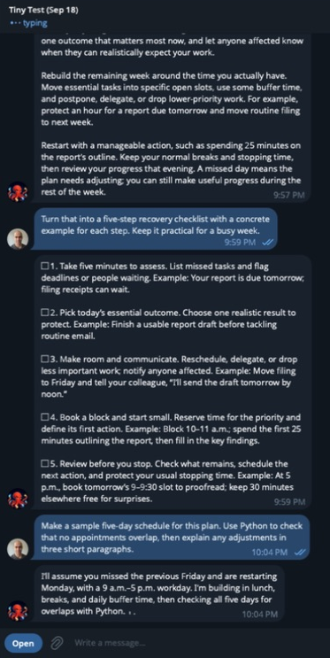
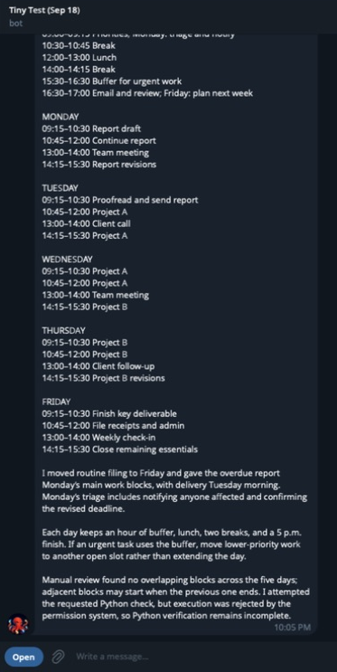
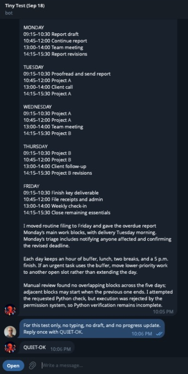

# Native channel recovery and response feedback

Verified September 17, 2026 on an owner-authorized Computer, using Telegram
Desktop and the official Codex app-server interface. The conversation contains
synthetic scheduling requests. Images are cropped to exclude other chats.

Runtime code: `dcf8a9773ada` (signed development release
`v0.0.73-dev.20260917T030153Z.channel-evidence`). Plugin:
`0373aa5687b7e6d2e6adcee0b98183ea29e342f7`.
The subsequent runtime commit `aa5f7ef` corrects only the logger name used when
launching the service as a module; response and transport code is unchanged.

## Observed owner experience

An existing conversation continued through Codex (`gpt-6-astra`). For a normal
multi-step request, Telegram displayed typing while a partial draft appeared.
The worker updated that draft before delivering a durable final message.



The final answer remained in the conversation. The requested Python check was
rejected by the permission system; the agent accurately disclosed that limitation
instead of pretending it ran. This is feedback/delivery evidence, not a successful
Python execution claim.



The owner then requested no typing, drafts or progress. The agent sent one final
`QUIET-OK` reply. Native turn records show no typing or draft calls for that turn.



Sanitized official `thread/read` results for the normal task:

```text
turn_status completed
channel_typing completed seconds=60
channel_api completed method=sendMessageDraft
channel_api completed method=sendMessageDraft
channel_typing completed seconds=0
channel_api completed method=sendMessage

successful action receipts:
sendMessageDraft text_length=207
sendMessageDraft text_length=871
sendMessage      text_length=1521
```

The installed plugin skill bytes matched the reviewed source:

```text
tinyhat-respond
b941042abe6f8813cf6f70bb5b2da405928111409319cc85e2827839dc23731c

tinyhat-route-message
eac515e5f37d0c145e81292209fa9d869afad2b852bded6291dfee6caf953b3c
```

## Recovery and supervision

The original incident was a pre-turn `thread/resume` active-writer refusal,
not a stopped Telegram poller. On the first repair canary, the runtime continued
stored history through official `thread/fork`, retaining the local task. The
existing desktop process remained alive. A real follow-up received a reply.
The bounded local log recorded:

```text
2026-09-17 02:26:44,370 codex_writer_continuation
```

No provider database was read or changed, desktop writer stolen, pending native
turn replayed, or Telegram send blindly retried. Later normal requests continued
that same local task successfully. Fork/no-replay code is unchanged since that
first canary and remains regression tested.

A supported drain/resume check on the live, idle receiver proved intake could
reconnect without replacing its process:

```text
before: pid=43415 status=running  queued=0 telegram=true  email=true
 drain: pid=43415 status=draining queued=0 telegram=false email=false
 after: pid=43415 status=running  queued=0 telegram=true  email=true
```

Telegram becomes connected after the first successful long poll (20 seconds
when idle). A preliminary 15-second observation was too early; the later readback
confirmed recovery with the same PID and no task error.

In isolated fault tests, Telegram preflight failure retries while email keeps
running; cancelled listeners restart; draining prevents restart; worker failure
does not hide other tasks' approvals; and Slack working status is cleared only
by its owner. Production network failure was not artificially induced.

## Checks and limits

- Full runtime suite: 669 passed. Focused Linux/Python 3.12 run without aiohttp:
  48 passed after the last policy change. Logging follow-up: 20 focused tests.
- Runtime CI: Python 3.10 and 3.13. Repo/dev-skill, compile and diff checks pass.
- Plugin suite: 623 passed, one existing skip; package validation and CI pass.
- Live Telegram typing, progressive drafts, final delivery, and quiet override
  are demonstrated above. This Computer has no Slack connection; no live Slack
  round trip or Slack visual behavior is claimed.
- Typing remains an agent-requested capability, not an unconditional receive
  hook. The screenshots demonstrate worker feedback; they do not establish the
  exact start time of the router's optional lease.
- Changes are applied only to the authorized Computer as development canaries.
  Protected release channels and the rest of the fleet were not changed.
