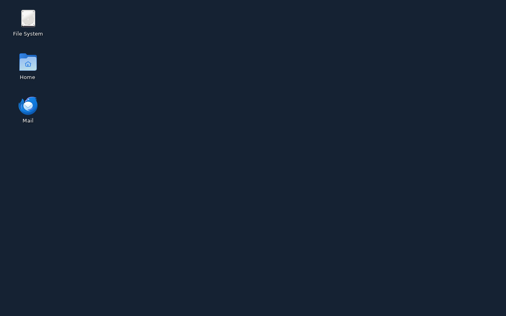
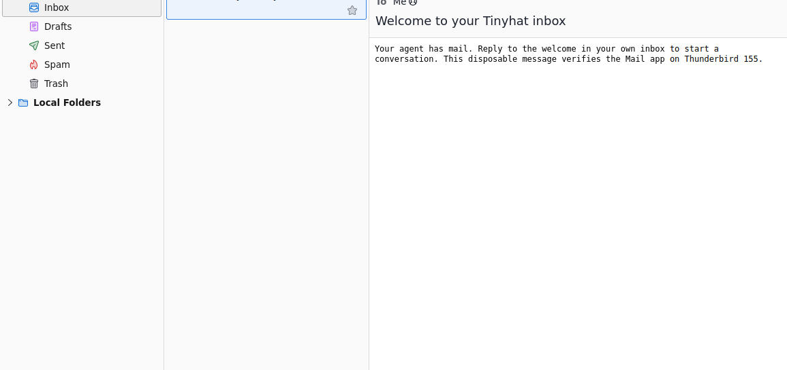

# Desktop Mail verification

The installer was exercised on an Ubuntu AMD64 image using Mozilla's native
Thunderbird package (155.0.1); the Snap placeholder was not used. A Linux desktop
container also opened Thunderbird 140.15 ESR through the `Mail` shortcut using
TLS IMAP 993 and SMTP 465 settings. A disposable real mailbox showed the Tinyhat
welcome message. Account-specific screenshots remain private.



The runtime keeps assignment fast: package installation happens during image
construction. Assignment writes the private profile settings and desktop entry;
it does not run apt. Profile and mailbox history survive address changes.

Validation on 2026-09-12:

```text
python -m unittest discover -s tests
Ran 521 tests in 37.096s
OK
```

Compile, repository/skill validators and shell syntax checks also passed.
This is Linux/container verification, not a production image rollout claim.


## Review follow-up: installed version

The updated launcher and AutoConfig were also exercised on the exact native
Mozilla Thunderbird **155.0.1** installed by the image script. On Ubuntu AMD64,
the launcher opened a new private profile, authenticated to a disposable real
mailbox over validated TLS IMAP 993, and displayed its test welcome. That
message was inserted through IMAP for this client compatibility check; it is
not a second external-send or Hermes-conversation claim. The mailbox and
container were removed afterward.



The screenshot is cropped directly from the Linux display to exclude the
mailbox address. It shows the folder pane and the received message. Desktop
setup failures now log only their exception class and cannot block Hermes's
email gateway. Assignment also checks that the managed launcher exists, and
preserves an existing private Desktop directory's permissions.
