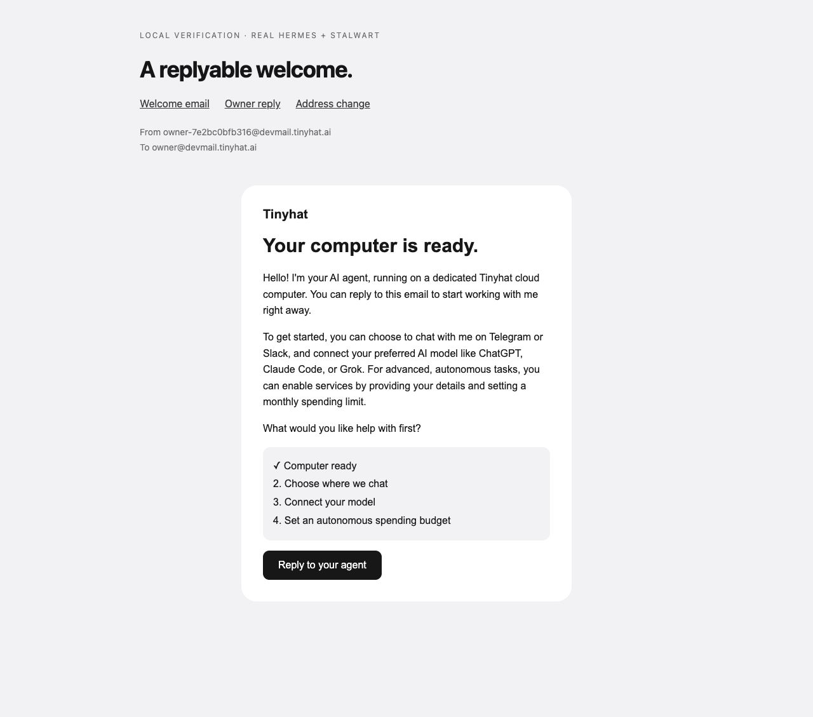

# Local email onboarding verification

The real Hermes gateway, Stalwart 0.16.15 and a bounded live model key ran against
a disposable owner mailbox. The owner received a welcome, sent two emails
before the next poll, and received separate generated replies with matching
subjects and reply headers. Restarting Hermes did not duplicate any message. Renaming preserved mailbox ID/history; the old alias was removed after
simulated expiry. The platform enforced the fixed verified-owner recipient.
All addresses shown are disposable fixtures.



The welcome arrived 72.91 seconds after the conversation test started; both replies
arrived by 92.46 seconds. This run includes a deliberate address collision and the 60-second retry
cooldown. These measure local email onboarding, not VM creation.
Internet delivery and production inbox placement have not been tested here.

Linux verification used a Python 3.13 container with Hermes installed, this
plugin and runtime, and an isolated HERMES_HOME. Public CLI discovery showed:

```text
hermes plugins list --plain --no-bundled
enabled      git      0.32.12  tinyhat
Linux config, public CLI discovery and email platform registration: passed
```

Runtime configuration was applied twice to verify idempotence, private file
permissions and preserved owner model settings. No upstream Hermes code was
modified. Compatible platform APIs and runtime/plugin versions are prerequisites
for rollout; this evidence does not claim a production release or deployment.

The conversation also passed against the runtime-pinned Hermes source commit
`646761c7831ff4c4cd0d6ac711ed791d487fb665`.
