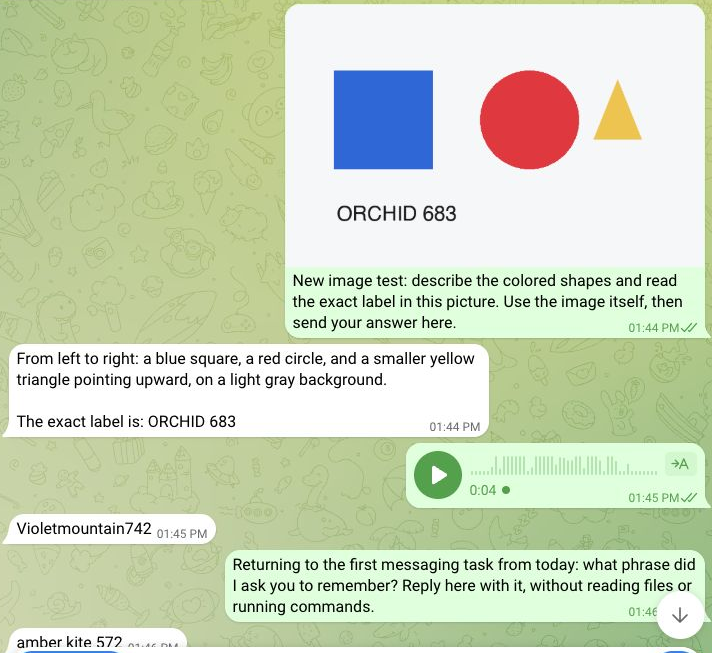
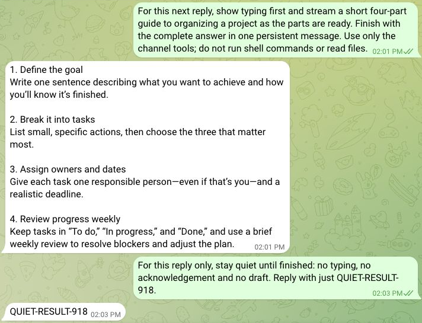
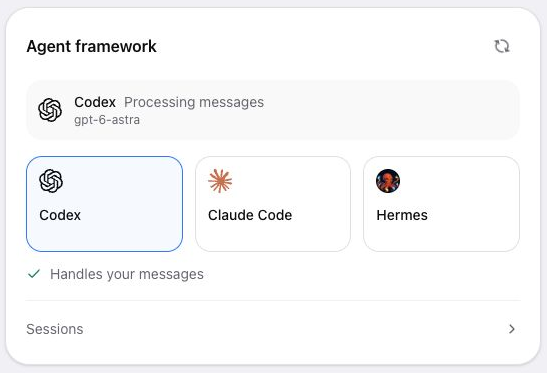

# Native channel verification

A disposable Linux Computer was created through the platform, signed in to
Codex using its official browser flow, and connected to a standing Telegram
test bot. This local integration combined the native-channel fix with the
separately reviewed browser sign-in fix in [PR #179](https://github.com/tinyloophub/tinyhat--runtimes--hermes/pull/179)
and the Tinyhat response skill at [revision b43670f](https://github.com/tinyhat-ai/tinyhat/blob/b43670f540ee9e9cfd832af3bc481dc0587ad544/skills/tinyhat-respond/SKILL.md).
It is not production rollout proof. Later review fixes clarify empty drafts
and uncertain receipts; those edge cases are checked against the provider
contract, not represented by these earlier screenshots.

- Text: sent a phrase, edited that same message, and recalled it after resuming
  the original native task. The send/edit receipts used the same message ID.
- Image: Codex identified three colored shapes and read ORCHID 683 from a real
  uploaded image (label shown as ORCHID 683 below).
- Voice: a real four-second voice note was transcribed with the configured STT
  utility; Codex replied Violetmountain742. This utility may call a provider,
  but it did not invoke a Hermes agent turn.
- Telegram feedback: sendChatAction succeeded; four sendMessageDraft calls
  carried 108, 202, 313, and 461 characters on the same draft ID; sendMessage then
  persisted 461 characters. The screenshot is the final result, not a recording
  of intermediate drafts.
- A following request for silence produced exactly one sendMessage operation,
  with QUIET-RESULT-918. No typing or draft was requested by the runtime.
- The live UI reported Codex and gpt-6-astra; the Hermes gateway was stopped.
  Native sessions and media remained on the Computer.

Slack stream scoping and owner audio/image intake have automated coverage.
A live Slack round trip has not been verified with this test Computer. Existing
Slack installations need files:read to download attachments. These tests do not
claim outbound voice synthesis or upload support.

