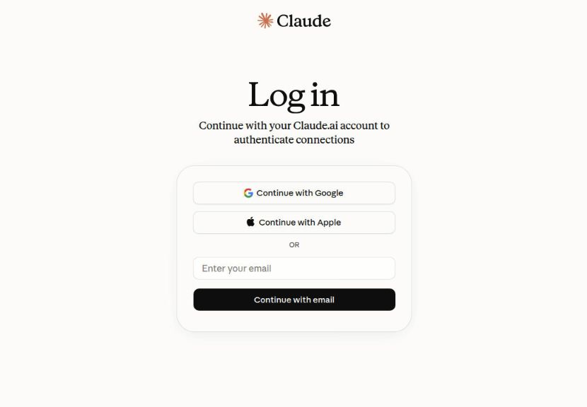

# Independent provider sign-in verification

A fresh Ubuntu 24.04 ARM64 test container used Codex 0.153.4, Claude Code
2.1.266, Node 24.21.0, and the runtime browser launcher from
`hermes_runtime/install_desktop_apps.sh`. Chromium for Testing provided the
browser; Xvfb, Openbox and noVNC provided the disposable desktop.

Before requesting either login, `agent_desktops.write_launchers` installed
both terminal-free desktop sign-in shortcuts. Using the real provider CLIs,
`signin.start` opened Claude Code first, then Codex while Claude was still
waiting. Neither provider had account credentials. The public statuses were:

```json
{
  "claude_code": {"framework": "claude_code", "status": "waiting"},
  "codex": {"framework": "codex", "status": "waiting"}
}
```

Repeated starts and both desktop shortcuts reused the existing workers and
browser receipts. Codex Browser Use confirmed both official login pages.
The screenshots exclude OAuth URLs. No credentials were entered, so this
proves login readiness rather than completed provider authentication.




Regression verification:

```text
python -m unittest discover -s tests -v
Ran 656 tests — OK
```

Focused tests cover same-provider reuse, an in-flight pre-upgrade worker,
independent worker locks and receipts, browser-launch failure, and fragmented
provider login links. No upstream Hermes Agent behavior or channel receiver
is changed by this fix.
