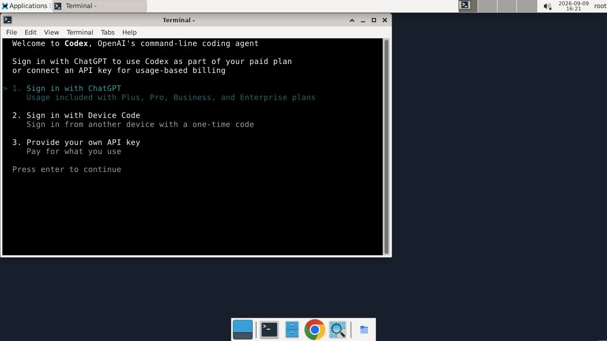

# Preinstalled agent Computer verification

Runtime source tested: `2944949082b2e868ee196bdd4399e2e94608bb5e` (this evidence-only follow-up does not change Python or boot scripts).

On 2026-09-09, two fresh Ubuntu 24.04 image clones booted in Google Cloud. Both reported all four public CLI probes ready: Codex 0.153.4, Claude Code 2.1.266, Hermes Agent v0.19.0 at pinned commit 646761c7, and OpenClaw 2026.9.3. Both had desktop prerequisites installed, the exact expected manifest digest, different fresh machine/SSH identities, an active guest agent, and no copied model/platform authentication. Cold verification took 59.517 and 59.832 seconds; both temporary clones were deleted.

A separate image-backed Computer received an authenticated coding-agent assignment through the candidate platform API. Its matching acknowledgement moved the allocation to ready. Opening its Guacamole desktop and double-clicking the Tinyhat Agent shortcut displayed the actual Codex welcome screen below. Model login was not attempted; no model account or device code is present in the evidence.

This proves the installed runtime/desktop and selected-system launcher. It does not establish a platform warm-allocation latency target, model authentication, production deployment, or runtime channel promotion. The candidate platform's shared development database exhausted its connection slots during further allocation tests; those timings remain pending in the platform change.

Local checks: 488 runtime unit tests passed; compileall, development-skill validation and repository-basics validation passed. Tests cover context validation and binding, CLI inventory, first-boot digest checks and idempotency, plus v2 heartbeat routing only for opted-in preinstalled GCE Computers. Legacy and local-runtime routing stays unchanged.
