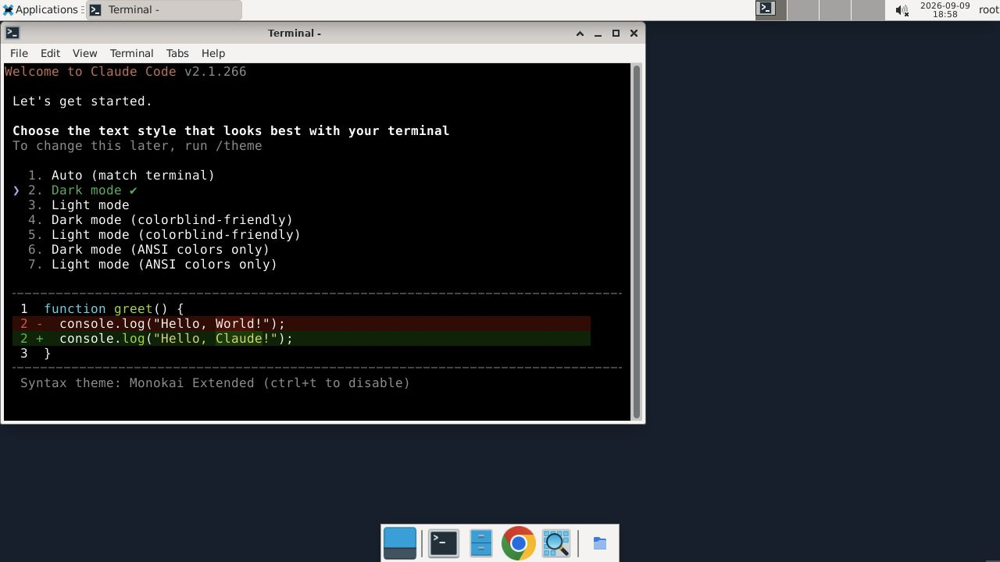

# Preinstalled agent Computer verification

Runtime source tested: `992098da90ba878bbef22ff921cd0045944f3943`.
This includes the review fixes for binding isolation, unavailable CLIs, callback
origin validation and background CLI inventory. The image is immutable; update
its runtime by baking and verifying a replacement image.

On 2026-09-09, two fresh Ubuntu 24.04 image clones on `e2-medium` booted in Google
Cloud. Both reported all four public CLI probes ready: Codex 0.153.4, Claude Code
2.1.266, Hermes Agent v0.19.0 at pinned commit 646761c7, and OpenClaw 2026.9.3.
Both had desktop prerequisites installed, the expected manifest digest, different
fresh machine/SSH identities, an active guest agent, and no copied model/platform
authentication. Cold verification took 46.880 and 50.376 seconds; both temporary
clones were deleted.

Four separate Computers from that image received authenticated coding-agent
assignments through the candidate platform API. Their matching acknowledgements
moved allocations to ready. Opening Guacamole and double-clicking the Tinyhat
Agent shortcut displayed the selected Codex and Claude Code launchers below.
Model login was not attempted; no account or device code is present.

Three sequential warm claims measured allocation at 3.375, 5.652 and 2.230
seconds, with visibly usable desktops by 28.797, 28.848 and 24.886 seconds.
These are local candidate-platform tests against real cloud guests; they do not
establish production deployment, model authentication or runtime channel promotion.

Local checks: 493 runtime unit tests passed, plus compileall, development-skill
validation and repository-basics validation. Linux CI passed on Python 3.10 and
3.13. Tests cover context/binding isolation, first-boot digest checks, inventory
timeouts and background scheduling, and v2 heartbeat routing only for opted-in
preinstalled GCE Computers. Legacy and local-runtime routing stays unchanged.
